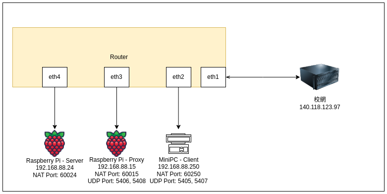

# ET5125701-Final

This repository contains the final project for **ET5125701**. The project demonstrates key concepts and practical applications related to transport Layer.

## Table of Contents

- [Introduction](#introduction)
- [Features](#features)
- [Installation](#installation)
- [Usage](#usage)
- [Project Structure](#project-structure)
- [Contributors](#contributors)
- [License](#license)

## Introduction


This study explores network transmission technologies as the core content of the final project. The research focuses on four major issues: basic implementation of UDP, analysis and resolution of potential problems in simulated network environments, performance optimization for large-scale packet transmission, and implementation of innovative solutions proposed for the mini project. Using Python as the development tool and integrating multi-threading technology, the study successfully overcame bottlenecks in simulated network problems and validated the feasibility and performance improvements of the proposed methods.


*Figure 1: Overview of the Project*

## Features

- [Feature 1: UDP]
- [Feature 2: Packet LOSS]
- [Feature 3: Re-transmission]

## Installation

To set up this project locally, follow these steps:

1. Clone the repository:
   ```bash
   git clone https://github.com/Richard-yq/ET5125701-Final.git
   ```
2. Navigate to the project directory:
   ```bash
   cd ET5125701-Final
   ```
3. Install dependencies:
   ```bash
   sudo apt install python
   sudo apt install wireshark
   ```

## Usage
1. Prepare three devices for testing
You can cd to Q1~Q5 and execute `sender.py` `receiver.py` `proxy.py`

```bash
python proxy.py 
python receiver.py 
python sender.py 
```

2. To get pcap (Q1~Q4)
```bash
sudo tcpdump -i any udp -w capture.pcap
```

## Project Structure

```plaintext
ET5125701-Final/
├── Q1/             # Source code
├── Q2/             # Source code
├── Q3/             # Source code
├── Q4/             # Source code
├── Q5/             # Source code
└── README.md       # Project documentation

```


## Contributors

- **Richard-yq CHEN,YI-QUAN.** - [GitHub Profile](https://github.com/Richard-yq)
- **SoSonoFuriren YANG, ZHI-YUAN.** - [GitHub Profile](https://github.com/SoSonoFuriren)
- **9joanna.** - [GitHub Profile](https://github.com/9joanna)

## License

This project is licensed under the [NTUST BMWLab. License]. See the [LICENSE](LICENSE) file for details.

---

Feel free to contribute to this project by submitting issues or pull requests. For any questions, contact [a2311496a@gmail.com].
